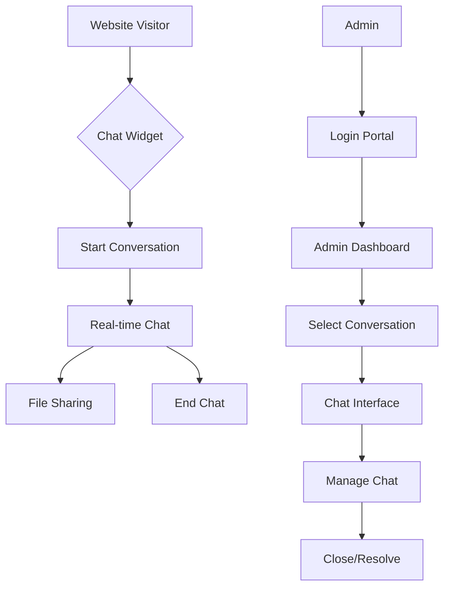

## 1. Product Overview
Live chat system with dual interface - customer-facing chat widget and admin dashboard for real-time support conversations. Enables businesses to provide instant customer service with persistent chat history, file sharing, and comprehensive conversation management.

## 2. Core Features

### 2.1 User Roles
| Role | Registration Method | Core Permissions |
|------|---------------------|------------------|
| Customer | Anonymous/Email optional | Initiate chats, send messages, share files |
| Admin | Email registration with admin approval | Manage all conversations, view customer history, system settings |

### 2.2 Feature Module
Live chat system consists of the following main pages:
1. **Customer Chat Widget**: Embedded floating chat interface with message input, file sharing, conversation history.
2. **Admin Dashboard**: Centralized console with conversation threads, customer info panel, chat management tools.
3. **Admin Login**: Secure authentication portal for admin access.

### 2.3 Page Details
| Page Name | Module Name | Feature description |
|-----------|-------------|---------------------|
| Customer Chat Widget | Chat Interface | Display real-time messages with timestamps, typing indicators, read receipts. Support text input with emoji picker. |
| Customer Chat Widget | File Sharing | Upload and preview images/documents with drag-and-drop support, file size validation, progress indicators. |
| Customer Chat Widget | Mobile Responsive | Adaptive layout for mobile devices with touch-friendly controls, collapsible interface. |
| Admin Dashboard | Conversation Threads | Auto-create threads per customer, color-coded status indicators, search/filter functionality, unread message counters. |
| Admin Dashboard | Chat Management | Real-time message display, quick reply templates, customer info sidebar, conversation assignment to agents. |
| Admin Dashboard | History Search | Search conversations by customer name, message content, date range, export chat transcripts. |
| Admin Login | Authentication | Email/password login with session management, password reset, remember me functionality. |

## 3. Core Process
**Customer Flow**: Customer visits website → Chat widget appears → Customer initiates conversation → Real-time messaging with admin → File sharing if needed → Conversation ends with option to email transcript

**Admin Flow**: Admin logs in → Dashboard loads active conversations → Click thread to open chat → Respond to messages in real-time → View customer history and info → Mark conversations as resolved/closed

## 4. User Interface Design

### 4.1 Design Style
- **Primary Colors**: Blue (#007BFF) for primary actions, Gray (#6C757D) for secondary elements
- **Button Style**: Rounded corners with subtle shadows, hover effects for interactivity
- **Typography**: Sans-serif fonts (Inter/Roboto), 14px base size for readability
- **Layout**: Card-based design with clear visual hierarchy, consistent spacing
- **Icons**: Material Design icons for consistency, emoji support for expressions

### 4.2 Page Design Overview
| Page Name | Module Name | UI Elements |
|-----------|-------------|-------------|
| Customer Chat Widget | Chat Window | Floating bubble icon expands to modal overlay, white background with subtle border, message bubbles with sender differentiation, timestamp in 12-hour format. |
| Customer Chat Widget | Input Area | Text input with send button, file attachment icon, emoji picker toggle, typing indicator below input. |
| Admin Dashboard | Thread List | Sidebar with scrollable conversation list, unread count badges, customer avatar placeholders, last message preview, timestamp. |
| Admin Dashboard | Chat Area | Main panel with message history, admin reply box with formatting toolbar, customer info card on right side. |
| Admin Login | Login Form | Centered card with logo, email/password fields, submit button, forgot password link, remember me checkbox. |

### 4.3 Responsiveness
Desktop-first design with mobile adaptation. Chat widget collapses to bottom-right corner on mobile with full-screen expansion option. Admin dashboard uses responsive grid layout with collapsible sidebar for smaller screens. Touch-optimized controls with appropriate tap targets.