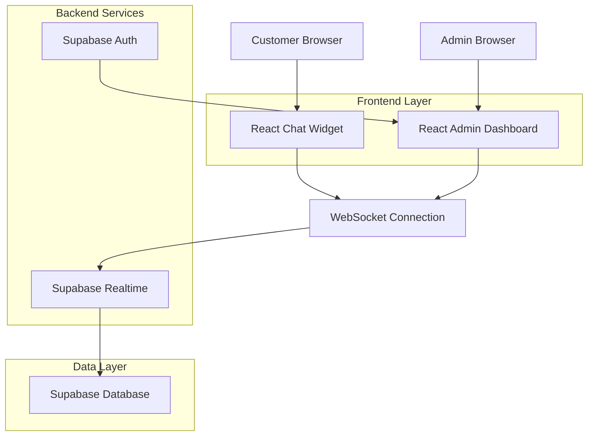
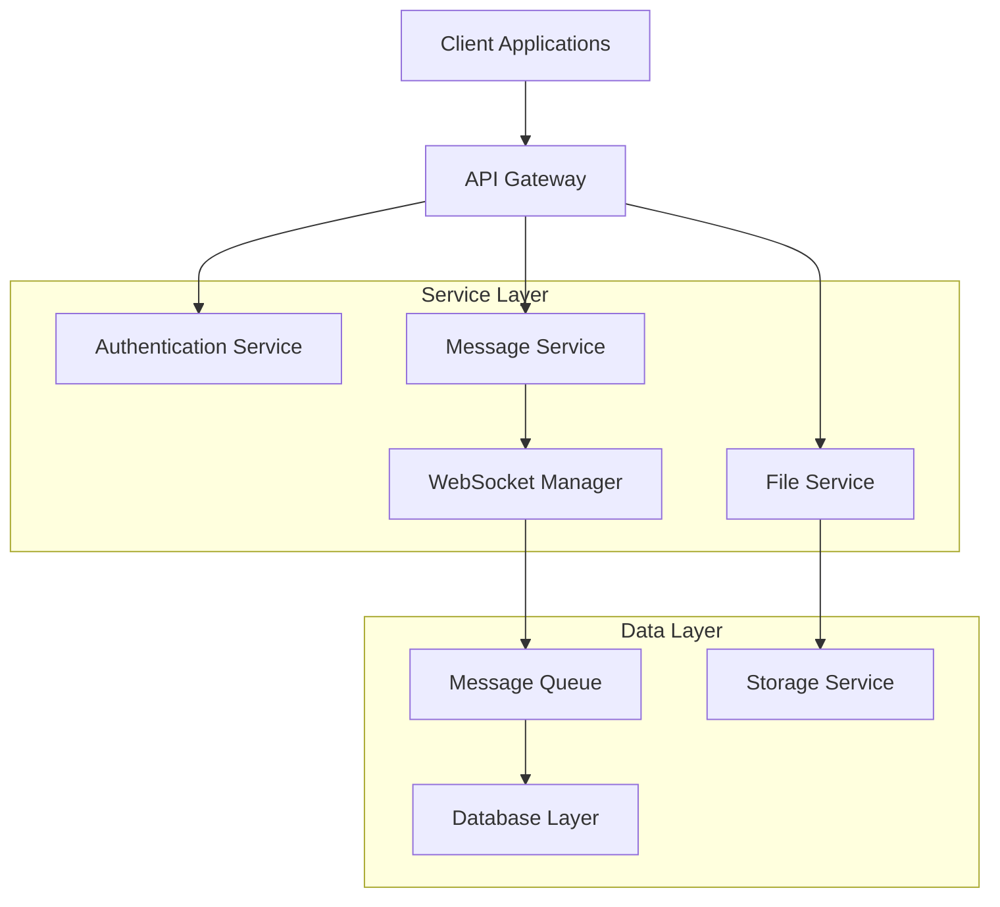
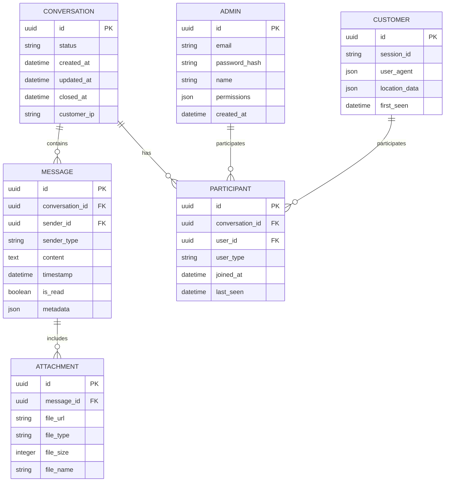

## 1. Architecture design



## 2. Technology Description
- Frontend: React@18 + tailwindcss@3 + vite + socket.io-client
- Backend: Supabase (Realtime, Auth, PostgreSQL, Storage)
- WebSocket: Socket.IO for real-time communication
- File Storage: Supabase Storage for file attachments

## 3. Route definitions
| Route | Purpose |
|-------|---------|
| /widget | Customer chat widget endpoint for embedding |
| /admin | Admin dashboard main interface |
| /admin/login | Admin authentication page |
| /admin/chat/:conversationId | Specific conversation view |

## 4. API definitions

### 4.1 Core API

**Message sending**
```
POST /api/messages/send
```

Request:
| Param Name | Param Type | isRequired | Description |
|------------|-------------|-------------|-------------|
| conversationId | string | true | Unique conversation identifier |
| senderType | string | true | 'customer' or 'admin' |
| message | string | true | Message content |
| timestamp | datetime | true | Message timestamp |

Response:
| Param Name | Param Type | Description |
|------------|-------------|-------------|
| messageId | string | Unique message identifier |
| status | string | 'sent' or 'failed' |
| deliveredAt | datetime | Delivery confirmation timestamp |

### 4.2 File Upload API
```
POST /api/files/upload
```

Request:
| Param Name | Param Type | isRequired | Description |
|------------|-------------|-------------|-------------|
| file | binary | true | File data |
| conversationId | string | true | Target conversation |
| fileType | string | true | 'image' or 'document' |

Response:
| Param Name | Param Type | Description |
|------------|-------------|-------------|
| fileUrl | string | Public URL for file access |
| fileSize | number | File size in bytes |
| uploadStatus | string | 'success' or 'error' |

### 4.3 Conversation Management API
```
GET /api/conversations/list
```

Request:
| Param Name | Param Type | isRequired | Description |
|------------|-------------|-------------|-------------|
| adminId | string | true | Admin user identifier |
| status | string | false | Filter by status (active/closed) |
| limit | number | false | Number of results |

Response:
| Param Name | Param Type | Description |
|------------|-------------|-------------|
| conversations | array | List of conversation objects |
| totalCount | number | Total conversation count |
| unreadCount | number | Number of unread conversations |

## 5. Server architecture diagram



## 6. Data model

### 6.1 Data model definition


### 6.2 Data Definition Language

**Conversations Table**
```sql
CREATE TABLE conversations (
  id UUID PRIMARY KEY DEFAULT gen_random_uuid(),
  status VARCHAR(20) DEFAULT 'active' CHECK (status IN ('active', 'closed', 'waiting')),
  created_at TIMESTAMP WITH TIME ZONE DEFAULT NOW(),
  updated_at TIMESTAMP WITH TIME ZONE DEFAULT NOW(),
  closed_at TIMESTAMP WITH TIME ZONE,
  customer_ip INET,
  metadata JSONB DEFAULT '{}'
);

CREATE INDEX idx_conversations_status ON conversations(status);
CREATE INDEX idx_conversations_created_at ON conversations(created_at DESC);
```

**Messages Table**
```sql
CREATE TABLE messages (
  id UUID PRIMARY KEY DEFAULT gen_random_uuid(),
  conversation_id UUID REFERENCES conversations(id) ON DELETE CASCADE,
  sender_id UUID NOT NULL,
  sender_type VARCHAR(10) NOT NULL CHECK (sender_type IN ('customer', 'admin')),
  content TEXT NOT NULL,
  timestamp TIMESTAMP WITH TIME ZONE DEFAULT NOW(),
  is_read BOOLEAN DEFAULT FALSE,
  metadata JSONB DEFAULT '{}'
);

CREATE INDEX idx_messages_conversation ON messages(conversation_id);
CREATE INDEX idx_messages_timestamp ON messages(timestamp DESC);
```

**Participants Table**
```sql
CREATE TABLE participants (
  id UUID PRIMARY KEY DEFAULT gen_random_uuid(),
  conversation_id UUID REFERENCES conversations(id) ON DELETE CASCADE,
  user_id UUID NOT NULL,
  user_type VARCHAR(10) NOT NULL CHECK (user_type IN ('customer', 'admin')),
  joined_at TIMESTAMP WITH TIME ZONE DEFAULT NOW(),
  last_seen TIMESTAMP WITH TIME ZONE DEFAULT NOW()
);

CREATE INDEX idx_participants_conversation ON participants(conversation_id);
CREATE INDEX idx_participants_user ON participants(user_id, user_type);
```

**Attachments Table**
```sql
CREATE TABLE attachments (
  id UUID PRIMARY KEY DEFAULT gen_random_uuid(),
  message_id UUID REFERENCES messages(id) ON DELETE CASCADE,
  file_url TEXT NOT NULL,
  file_type VARCHAR(50) NOT NULL,
  file_size INTEGER NOT NULL,
  file_name TEXT NOT NULL,
  uploaded_at TIMESTAMP WITH TIME ZONE DEFAULT NOW()
);

CREATE INDEX idx_attachments_message ON attachments(message_id);
```

**Row Level Security Policies**
```sql
-- Grant access to anon role for customer interactions
GRANT SELECT ON conversations TO anon;
GRANT INSERT ON conversations TO anon;
GRANT SELECT, INSERT ON messages TO anon;
GRANT SELECT, INSERT ON participants TO anon;

-- Grant full access to authenticated role for admin operations
GRANT ALL PRIVILEGES ON conversations TO authenticated;
GRANT ALL PRIVILEGES ON messages TO authenticated;
GRANT ALL PRIVILEGES ON participants TO authenticated;
GRANT ALL PRIVILEGES ON attachments TO authenticated;

-- Enable RLS
ALTER TABLE conversations ENABLE ROW LEVEL SECURITY;
ALTER TABLE messages ENABLE ROW LEVEL SECURITY;
ALTER TABLE participants ENABLE ROW LEVEL SECURITY;

-- Create policies for customers (anon role)
CREATE POLICY "Customers can view their own conversations" ON conversations
  FOR SELECT TO anon USING (
    customer_ip = inet_client_addr() OR 
    EXISTS (
      SELECT 1 FROM participants 
      WHERE conversation_id = conversations.id 
      AND user_type = 'customer'
    )
  );

CREATE POLICY "Customers can insert messages" ON messages
  FOR INSERT TO anon WITH CHECK (
    sender_type = 'customer' AND
    EXISTS (
      SELECT 1 FROM conversations 
      WHERE id = messages.conversation_id
      AND status = 'active'
    )
  );
```